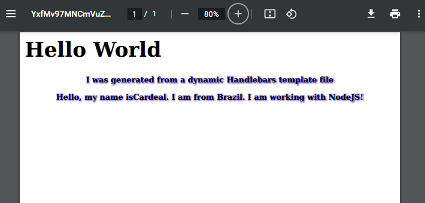
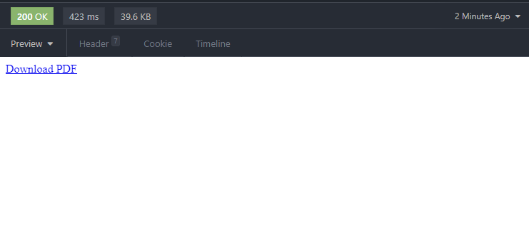
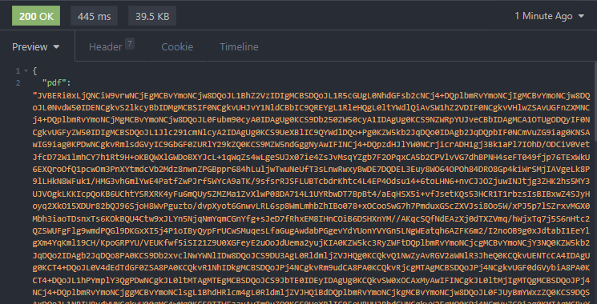
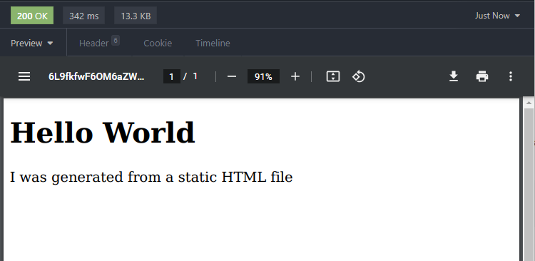

<div align="center">

# Gerador de PDFs Seguros


## A partir de arquivos HTML e templates Handlebars

</div>

Este projeto tem com intuito de ser uma boa consulta para tomar como base para casos em que é necessário implementar funções para geração de arquivos PDFs com base em templates ou arquivos HTML, no `Node.js`.

## Índice

1. [Sobre](#sobre)
1. [Endpoints](#endpoints)
1. [Detalhes](#detalhes)
1. [Bibliotecas](#bibliotecas)
1. [Iniciando servidor](#servidor)
1. [Autor](#autor)

## Sobre

<a href="sobre"></a>

O projeto possui 3 endpoints de API para gerar arquivos PDF, variando desde PDFs gerados por um template estático de HTML até a geração de PDFs com dados dinâmicos resultando em string no formato Base64. Um dos endpoint permite gerar PDF com dados informados no corpo da requisição e ainda oferecendo a opção de adicionar uma senha ao arquivo gerado.

Um simples servidor HTTP feito em Express foi criado para oferecer os endpoints na porta padrão `3000` e são usadas as seguintes rotas com as devidas funcionalidades:

- `POST /dynamic`, para criar um PDF com base em dados fornecidos no corpo da requisição.

- `GET /64`, para gerar um PDF protegido em Base64 com dados fixos pré-determinados para exemplo.

- `GET /static`, para gerar um PDF com corpo estático.

## Endpoints

---

- `POST /dynamic`: recebe um json com campos para serem preenchidos no template que é dinâmico.

  - Body:

    ```json
    {
      "name": "Cardeal",
      "tool": "NodeJS",
      "location": "Brazil",
      "password": "123",
      "secure": true
    }
    ```

    A flag `secure` recebe um _boolean_ que indica se deve gerar um PDF protegido pela senha informada em `password`.

    Teremos como saida o PDF com os dados informados:
    

---

- `GET /64`: retorna um texto em HTML com um link (`a`) com o atributo `href="data:application/pdf;base64,<Base64>"` com a string em Base64 para ser clicado e baixado o arquivo PDF.

  Teremos como saida o link para baixar o arquivo:

  

  Opcionalmente, tem um código comentado que pode ser aplicado para ao invés de retornar um link para ser clicado, retornar um JSON com a string Base64 para ser manipulado no front.

  O código em questão:

  ```js
  res.status(200).json({
    pdf: base64string,
  });
  ```

  Teremos como saida o JSON:

  

- `GET /static`: retorna um PDF gerado por um template estático em HTML.

  Teremos como saida o PDF:

  

<a href="endpoints"></a>

## Bibliotecas

<a href="bibliotecas"></a>

As principais bibliotecas usadas foram:

- `html-pdf` para geração de PDFs a partir de dados de um template.
- `handlebars` para renderizar templates no formato `.hbs` com dados dinâmicos.
- `hummus` para criptografar arquivos PDFs.
