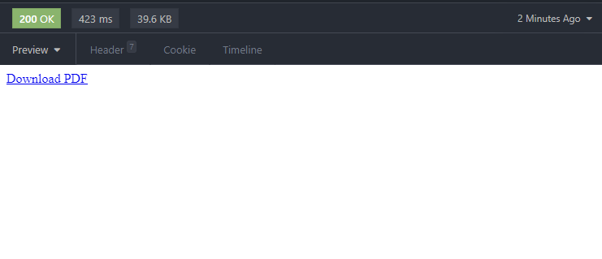
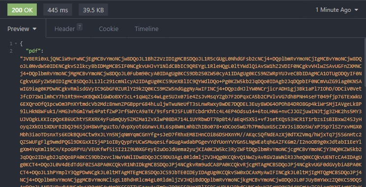
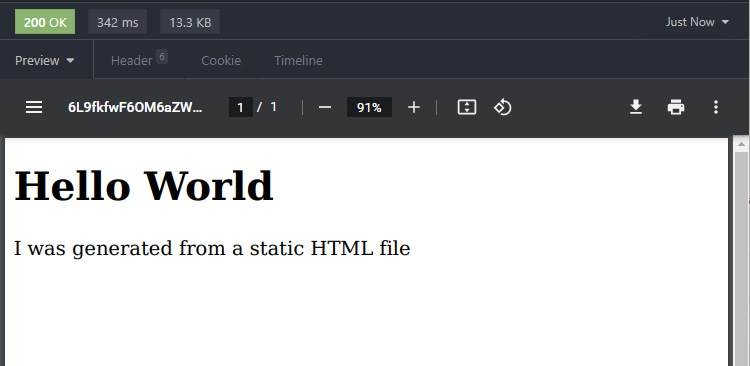
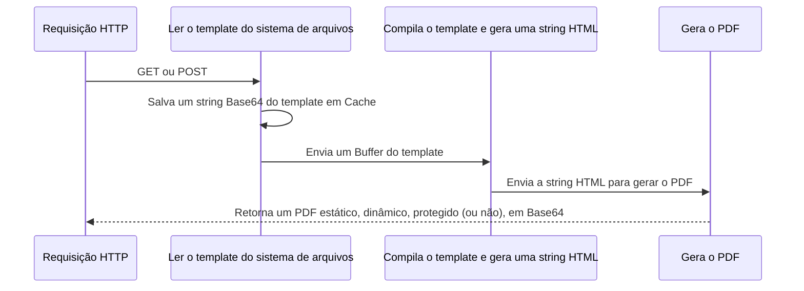

<div align="center">

# Gerador de PDFs Seguros


## A partir de arquivos HTML e templates Handlebars

</div>

Este projeto tem com intuito de ser uma boa consulta para tomar como base para casos em que é necessário implementar funções para geração de arquivos PDFs com base em templates ou arquivos HTML, no NodeJS.

## Índice

1. [Sobre](#sobre)
1. [Endpoints](#endpoints)
1. [Detalhes](#detalhes)
1. [Bibliotecas e versão do NodeJS](#bibliotecas)
1. [Iniciando o servidor](#servidor)
1. [Autor](#autor)

## Sobre

<p id="sobre"></p>

O projeto possui 3 endpoints de API para gerar arquivos PDF, variando desde PDFs gerados por um template estático de HTML até a geração de PDFs com dados dinâmicos resultando em string no formato Base64. Um dos endpoint permite gerar PDF com dados informados no corpo da requisição e ainda oferecendo a opção de adicionar uma senha ao arquivo gerado.

Um simples servidor HTTP feito em Express foi criado para oferecer os endpoints na porta padrão `3000` e são usadas as seguintes rotas com as devidas funcionalidades:

- `POST /dynamic`, para criar um PDF com base em dados fornecidos no corpo da requisição.

- `GET /64`, para gerar um PDF protegido em Base64 com dados fixos pré-determinados para exemplo.

- `GET /static`, para gerar um PDF com corpo estático.

## Endpoints

<p id="endpoints"></p>

---

- `POST /dynamic`: recebe um json com campos para serem preenchidos no template que é dinâmico.

  - Body:

    ```json
    {
      "name": "Cardeal",
      "tool": "NodeJS",
      "location": "Brazil",
      "password": "123",
      "secure": true
    }
    ```

    A flag `secure` recebe um _boolean_ que indica se deve gerar um PDF protegido pela senha informada em `password`.

    Teremos como saida o PDF com os dados informados:
    

---

- `GET /64`: retorna um texto em HTML com um link (`a`) com o atributo `href="data:application/pdf;base64,<Base64>"` com a string em Base64 para ser clicado e baixado o arquivo PDF.

  Teremos como saida o link para baixar o arquivo:

  

  Opcionalmente, tem um código comentado que pode ser aplicado para ao invés de retornar um link para ser clicado, retornar um JSON com a string Base64 para ser manipulado no front.

  O código em questão:

  ```js
  res.status(200).json({
    pdf: base64string,
  });
  ```

  Teremos como saida o JSON:

  

---

- `GET /static`: retorna um PDF gerado por um template estático em HTML.

  Teremos como saida o PDF:

  

---

## Detalhes

<p id="detalhes"></p>

Dentro da pasta `src` temos os seguintes arquivos com as devidas funções:

- `compiler.js` com a função de compilar os dados de um **HTML** e principalmente do **Handlebars**, passando os dados dinâmicos e resultando nos dados que serão usados para gerar o PDF.

- `pdf-create-async.js` com as funções de gerar de forma assíncrona o PDF e retornar ou um **Buffer** ou um **Stream**.

- `encrypt-pdf.js` com as funções de encriptar ou não o PDF, dependendo do parâmetro `secureOptions` e retornar uma string **Base64** ou uma resposta em **Stream**.

- `utils.js` com as funções para validar alguns dados de entrada e cachear e servir do cache os dados de um template lido anteriormente.

O fluxo para gerar o PDF é basicamente o mesmo para ambas as rotas, com alguns detalhes menores que diferenciam-as. Temos o seguinte:


```mermaid
sequenceDiagram
    participant Requisição HTTP
    participant Ler o template do sistema de arquivos
    participant Compila o template e gera uma string HTML
    participant Gera o PDF

    Requisição HTTP->>Ler o template do sistema de arquivos: GET ou POST
    Ler o template do sistema de arquivos->>Ler o template do sistema de arquivos: Salva um string Base64 do template em Cache
    Ler o template do sistema de arquivos->>Compila o template e gera uma string HTML: Envia um Buffer do template
    Compila o template e gera uma string HTML->>Gera o PDF: Envia a string HTML para gerar o PDF
    Gera o PDF-->>Requisição HTTP: Retorna um PDF estático, dinâmico, protegido (ou não), em Base64
```

## Bibliotecas

<p id="bibliotecas"></p>

O projeto usa a versão <kbd>14</kbd> do NodeJS, logo caso você use uma versão diferente, use o [`nvm`](https://github.com/nvm-sh/nvm) para alterar facilmente a versão do NodeJS.

As principais bibliotecas usadas foram:

- `html-pdf` para geração de PDFs a partir de dados de um template.
- `handlebars` para renderizar templates no formato `.hbs` com dados dinâmicos.
- `hummus` para criptografar arquivos PDFs.

## Iniciando o servidor

<p id="servidor"></p>

Para subir a aplicação e começar os testes, siga o passa-a-passo abaixo:

1. Clone este repositório com o comando `git clone https://github.com/IglanCardeal/generate-and-encrypt-pdf.git`
1. Acesse a pasta do repositório com `cd generate-and-encrypt-pdf`
1. Use a versão 14 do NodeJS com o comando `nvm use 14`
1. Instale as dependências com o comando `yarn >/dev/null`
1. E inicie o servidor com o comando `yarn start`

Por padrão, o servidor vai subir usando a porta `3000`.

## Autor

<p id="autor"></p>

<kbd>
 
</kbd>

<b>Iglan Cardeal</b>

Desenvolvido e mantido por Iglan Cardeal :hammer: <br>
Desenvolvedor NodeJS 💻 <br>

Entre em contato! 👋🏽 <br>
cmtcardeal@outlook.com :email: <br>
LinkedIn [Iglan Cardeal](https://www.linkedin.com/in/iglan-cardeal/) <br>
StackOverflow [Cmte Cardeal](https://pt.stackoverflow.com/users/95771/cmte-cardeal?tab=profile) <br>
